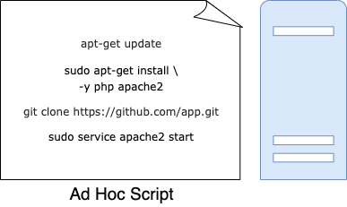
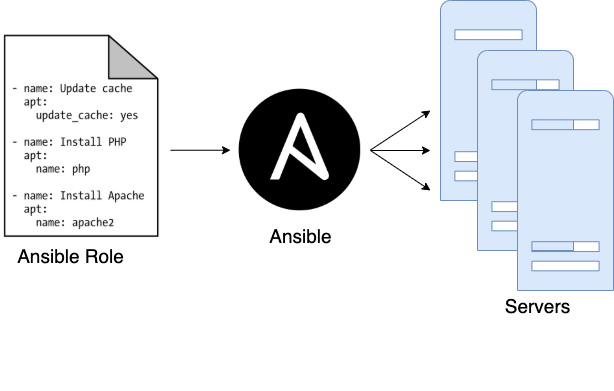
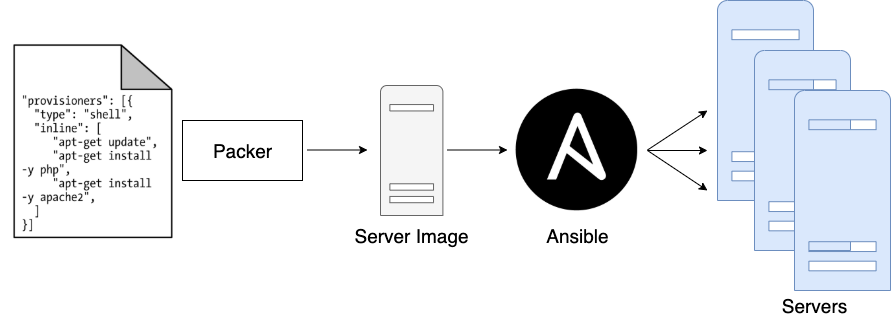
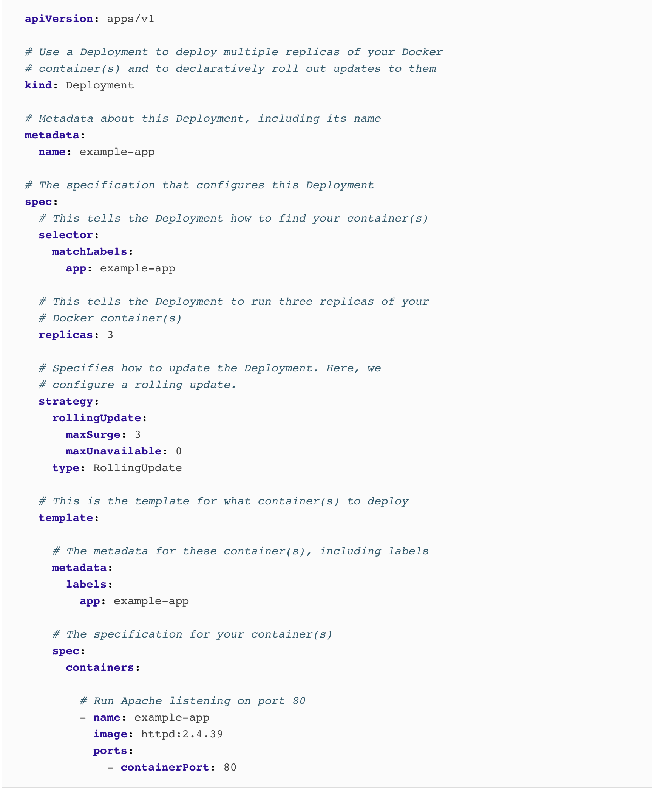
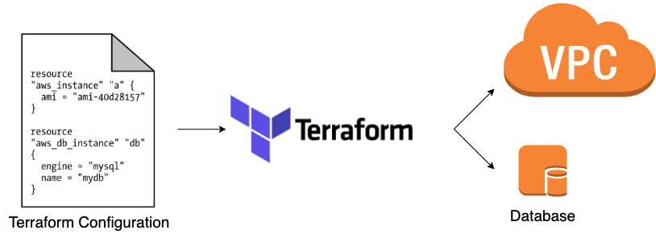

# Infrastructure as Code Overview

- [Infrastructure as Code Overview](#infrastructure-as-code-overview)
  - [What is IaC](#what-is-iac)
  - [Ad Hoc Scripts](#ad-hoc-scripts)
  - [Configuration Management Tools](#configuration-management-tools)
  - [Server Templating Tools](#server-templating-tools)
  - [Orchestration Tools](#orchestration-tools)
  - [Provisioning Tools](#provisioning-tools)
  - [The Benefits of IaC](#the-benefits-of-iac)

## What is IaC

The idea behind infrastructure as code (IAC) is that you write and execute code to define, deploy, update, and destroy your infrastructure. This represents an important shift in mindset in which you treat all aspects of operations as software—even those aspects that represent hardware (e.g., setting up physical servers). In fact, a key insight of DevOps is that you can manage almost everything in code, including servers, databases, networks, log files, application configuration, documentation, automated tests, deployment processes, and so on.

## Ad Hoc Scripts

The most straightforward approach to automating anything is to write an ad hoc script. You take whatever task you were doing manually, break it down into discrete steps, use your favorite scripting language (e.g., Bash, Ruby, Python) to define each of those steps in code, and execute that script on your server.



For example, here is a Bash script called setup-webserver.sh that configures a web server by installing dependencies, checking out some code from a Git repo, and firing up an Apache web server:

```bash
# Update the apt-get cache
sudo apt-get update

# Install PHP and Apache
sudo apt-get install -y php apache2

# Copy the code from the repository
sudo git clone https://github.com/brikis98/php-app.git /var/www/html/app

# Start Apache
sudo service apache2 start
```

The great thing about ad hoc scripts is that you can use popular, general-purpose programming languages and you can write the code however you want. The terrible thing about ad hoc scripts is that you can use popular, general-purpose programming languages and you can write the code however you want.

Whereas tools that are purpose-built for IAC provide concise APIs for accomplishing complicated tasks, if you’re using a general-purpose programming language, you need to write completely custom code for every task. Moreover, tools designed for IAC usually enforce a particular structure for your code, whereas with a general-purpose programming language, each developer will use their own style and do something different. Neither of these problems is a big deal for an eight-line script that installs Apache, but it gets messy if you try to use ad hoc scripts to manage dozens of servers, databases, load balancers, network configurations, and so on.

If you’ve ever had to maintain a large repository of Bash scripts, you know that it almost always devolves into a mess of unmaintainable spaghetti code. Ad hoc scripts are great for small, one-off tasks, but if you’re going to be managing all of your infrastructure as code, then you should use an IaC tool that is purpose-built for the job.

## Configuration Management Tools

Chef, Puppet, Ansible, and SaltStack are all configuration management tools, which means that they are designed to install and manage software on existing servers. For example, here is an Ansible Role called web-server.yml that configures the same Apache web server as the setup-webserver.sh script:

```yaml
- name: Update the apt-get cache
  apt:
    update_cache: yes

- name: Install PHP
  apt:
    name: php

- name: Install Apache
  apt:
    name: apache2

- name: Copy the code from the repository
  git: repo=https://github.com/brikis98/php-app.git dest=/var/www/html/app

- name: Start Apache
  service: name=apache2 state=started enabled=yes
```

The code looks similar to the Bash script, but using a tool like Ansible offers a number of advantages:

- Coding conventions: Ansible enforces a consistent, predictable structure, including documentation, file layout, clearly named parameters, secrets management, and so on. While every developer organizes their ad hoc scripts in a different way, most configuration management tools come with a set of conventions that makes it easier to navigate the code.

- Idempotence: Writing an ad hoc script that works once isn’t too difficult; writing an ad hoc script that works correctly even if you run it over and over again is a lot more difficult. Every time you go to create a folder in your script, you need to remember to check whether that folder already exists; every time you add a line of configuration to a file, you need to check that line doesn’t already exist; every time you want to run an app, you need to check that the app isn’t already running.  

Code that works correctly no matter how many times you run it is called idempotent code. To make the Bash script from the previous section idempotent, you’d need to add many lines of code, including lots of if-statements. Most Ansible functions, on the other hand, are idempotent by default. For example, the web-server.yml Ansible role will install Apache only if it isn’t installed already and will try to start the Apache web server only if it isn’t running already.

- Distribution: Ad hoc scripts are designed to run on a single, local machine. Ansible and other configuration management tools are designed specifically for managing large numbers of remote servers



For example, to apply the web-server.yml role to five servers, you first create a file called hosts that contains the IP addresses of those servers:

```yaml
[webservers]
11.11.11.11
11.11.11.12
11.11.11.13
11.11.11.14
11.11.11.15
```

Next, you define the following Ansible playbook:

```yaml
- hosts: webservers
  roles:
  - webserver
```

Finally, you execute the playbook as follows:

```
ansible-playbook playbook.yml
```

This instructs Ansible to configure all five servers in parallel. Alternatively, by setting a parameter called serial in the playbook, you can do a rolling deployment, which updates the servers in batches. For example, setting serial to 2 directs Ansible to update two of the servers at a time, until all five are done. Duplicating any of this logic in an ad hoc script would take dozens or even hundreds of lines of code.

## Server Templating Tools

An alternative to configuration management that has been growing in popularity recently are server templating tools such as Docker, Packer, and Vagrant. Instead of launching a bunch of servers and configuring them by running the same code on each one, the idea behind server templating tools is to create an image of a server that captures a fully self-contained “snapshot” of the operating system (OS), the software, the files, and all other relevant details. You can then use some other IaC tool to install that image on all of your servers.



## Orchestration Tools

Server templating tools are great for creating VMs and containers, but how do you actually manage them? For most real-world use cases, you’ll need a way to do the following:

- Deploy VMs and containers, making efficient use of your hardware.

- Roll out updates to an existing fleet of VMs and containers using strategies such as rolling deployment, blue-green deployment, and canary deployment.

- Monitor the health of your VMs and containers and automatically replace unhealthy ones (auto healing).

- Scale the number of VMs and containers up or down in response to load (auto scaling).

- Distribute traffic across your VMs and containers (load balancing).

- Allow your VMs and containers to find and talk to one another over the network (service discovery).

Handling these tasks is the realm of orchestration tools such as Kubernetes, Marathon/Mesos, Amazon Elastic Container Service (Amazon ECS), Docker Swarm, and Nomad. For example, Kubernetes allows you to define how to manage your Docker containers as code. You first deploy a Kubernetes cluster, which is a group of servers that Kubernetes will manage and use to run your Docker containers. Most major cloud providers have native support for deploying managed Kubernetes clusters, such as Amazon Elastic Container Service for Kubernetes (Amazon EKS), Google Kubernetes Engine (GKE), and Azure Kubernetes Service (AKS).

Once you have a working cluster, you can define how to run your Docker container as code in a YAML file:



This file instructs Kubernetes to create a Deployment, which is a declarative way to define:

- One or more Docker containers to run together. This group of containers is called a Pod. The Pod defined in the preceding code contains a single Docker container that runs Apache.

- The settings for each Docker container in the Pod. The Pod in the preceding code configures Apache to listen on port 80.

- How many copies (aka replicas) of the Pod to run in your cluster. The preceding code configures three replicas. Kubernetes automatically figures out where in your cluster to deploy each Pod, using a scheduling algorithm to pick the optimal servers in terms of high availability (e.g., try to run each Pod on a separate server so a single server crash doesn’t take down your app), resources (e.g., pick servers that have available the ports, CPU, memory, and other resources required by your containers), performance (e.g., try to pick servers with the least load and fewest containers on them), and so on. Kubernetes also constantly monitors the cluster to ensure that there are always three replicas running, automatically replacing any Pods that crash or stop responding.

- How to deploy updates. When deploying a new version of the Docker container, the preceding code rolls out three new replicas, waits for them to be healthy, and then undeploys the three old replicas.

That’s a lot of power in just a few lines of YAML! You run kubectl apply -f example-app.yml to instruct Kubernetes to deploy your app. You can then make changes to the YAML file and run kubectl apply again to roll out the updates.

## Provisioning Tools

Whereas configuration management, server templating, and orchestration tools define the code that runs on each server, provisioning tools such as Terraform, CloudFormation, and OpenStack Heat are responsible for creating the servers themselves. In fact, you can use provisioning tools to not only create servers, but also databases, caches, load balancers, queues, monitoring, subnet configurations, firewall settings, routing rules, Secure Sockets Layer (SSL) certificates, and almost every other aspect of your infrastructure.



For example, the following code deploys a web server using Terraform:

```go
resource "aws_instance" "app" {
  instance_type     = "t2.micro"
  availability_zone = "us-east-2a"
  ami               = "ami-0c55b159cbfafe1f0"

  user_data = <<-EOF
              #!/bin/bash
              sudo service apache2 start
              EOF
}
```

where

- ami: This parameter specifies the ID of an AMI to deploy on the server. You could set this parameter to the ID of an AMI built from the web-server.json Packer template in the previous section, which has PHP, Apache, and the application source code.

- user_data: This is a Bash script that executes when the web server is booting. The preceding code uses this script to boot up Apache.

In other words, this code shows you provisioning and server templating working together, which is a common pattern in immutable infrastructure.

## The Benefits of IaC

When your infrastructure is defined as code, you are able to use a wide variety of software engineering practices to dramatically improve your software delivery process, including the following:

- Self-service: If your infrastructure is defined in code, the entire deployment process can be automated, and developers can kick off their own deployments whenever necessary.
- Speed and safety: If the deployment process is automated, it will be significantly faster, since a computer can carry out the deployment steps far faster than a person; and safer, given that an automated process will be more consistent, more repeatable, and not prone to manual error.
- Documentation: Instead of the state of your infrastructure being locked away in a single sysadmin’s head, you can represent the state of your infrastructure in source files that anyone can read.
- Version control: You can store your IaC source files in version control, which means that the entire history of your infrastructure is now captured in the commit log.
- Validation: If the state of your infrastructure is defined in code, for every single change, you can perform a code review, run a suite of automated tests, and pass the code through static analysis tools—all practices that are known to significantly reduce the chance of defects.
- Reuse: You can package your infrastructure into reusable modules, so that instead of doing every deployment for every product in every environment from scratch, you can build on top of known, documented, battle-tested pieces.
- Happiness: There is one other very important, and often overlooked, reason for why you should use IaC: happiness. IaC offers a better alternative that allows computers to do what they do best (automation) and developers to do what they do best (coding).
