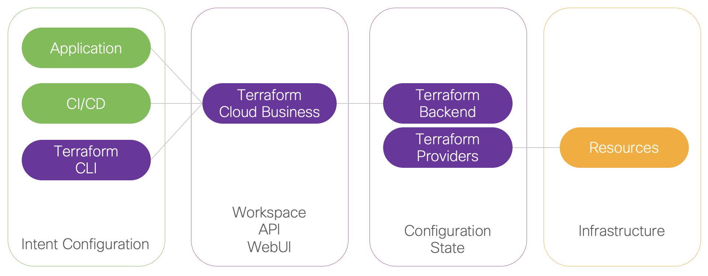
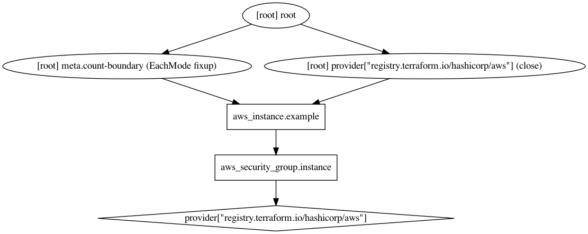

# Terraform Overview

- [Terraform Overview](#terraform-overview)
  - [What is Terraform](#what-is-terraform)
  - [Architecture](#architecture)
  - [Configuration Files](#configuration-files)
  - [Workflow](#workflow)
  - [Dependencies Graph](#dependencies-graph)
  - [State Files](#state-files)
  - [Glossary](#glossary)
  
## What is Terraform  

Terraform is a tool for building, changing, and versioning infrastructure as code. Infrastructure is managed as code meaning it is described using files and a high-level configuration syntax (HCL: Hashicorp Configuration Language, designed to be both human readable and machine friendly). Terraform can manage existing and popular service providers (AWS, GCP, ...) as well as custom in-house solutions (Cisco Intersight, ACI, Kubernetes, VMware, Openstack...).

The infrastructure Terraform can manage includes low-level components such as compute instances, storage, and networking, as well as high-level components such as DNS entries, SaaS features, etc.  

The Terraform  key features are listed below:  

- Infrastructure as Code: Infrastructure is described using a high-level and declarative configuration syntax (HCL: HashiCorp Configuration Language).  
- Execution Plans: Terraform has a "planning" step called execution plan, it shows the changes that will be configured when the plan is applied.  
- Resource Graph: Terraform builds a graph of all your resources, and parallelizes the creation and modification of any non-dependent resources.  
- Change Automation: Terraform keep configuration states (real view of resources configuration) and figure out the changes and in what order to reach the intent.  

Terraform providers abstract the API layer of real resources (Google Cloud, Azure, AWS, Cisco, ...).

## Architecture



## Configuration Files

Terraform code is written in the HashiCorp Configuration Language (HCL) in files with the extension .tf. It is a declarative language, so your goal is to describe the infrastructure you want, and Terraform will figure out how to create it. 

The first step to using Terraform is typically to configure the provider(s) you want to use. Create an empty folder and put a file in it called main.tf that contains the following contents:

```go
provider "aws" {
  region = "us-east-2"
}
```

This tells Terraform that you are going to be using AWS as your provider and that you want to deploy your infrastructure into the us-east-2 region.

For each type of provider, there are many different kinds of resources that you can create, such as servers, databases, and load balancers. The general syntax for creating a resource in Terraform is:

```go
resource "<PROVIDER>_<TYPE>" "<NAME>" {
  [CONFIG ...]
}
```

where PROVIDER is the name of a provider (e.g., aws), TYPE is the type of resource to create in that provider (e.g., instance), NAME is an identifier you can use throughout the Terraform code to refer to this resource (e.g., my_instance), and CONFIG consists of one or more arguments that are specific to that resource.

For example, to deploy a single (virtual) server in AWS, known as an EC2 Instance, use the aws_instance resource in main.tf as follows:

```go
resource "aws_instance" "example" {
  ami           = "ami-0c55b159cbfafe1f0"
  instance_type = "t2.micro"
}
```

where:

- ami: The Amazon Machine Image (AMI) to run on the EC2 Instance. You can find free and paid AMIs in the AWS Marketplace or create your own using tools such as Packer (see “Server Templating Tools” for a discussion of machine images and server templating). The preceding code example sets the ami parameter to the ID of an Ubuntu 18.04 AMI in us-east-2. This AMI is free to use.

- instance_type: The type of EC2 Instance to run. Each type of EC2 Instance provides a different amount of CPU, memory, disk space, and networking capacity. The EC2 Instance Types page lists all the available options. The preceding example uses t2.micro, which has one virtual CPU, 1 GB of memory, and is part of the AWS free tier.

## Workflow

Terraform workflow includes the following steps:

1. terraform init: scan the code, figure out which providers you’re using, and download the code for them.
2. terrafom plan: let you see what Terraform will do before actually making any changes
3. terraform apply: to actually create/update/delete the resources

## Dependencies Graph

When you add a reference from one resource to another, you create an implicit dependency. Terraform parses these dependencies, builds a dependency graph from them, and uses that to automatically determine in which order it should create resources.



## State Files

Every time you run Terraform, it records information about what infrastructure it created in a Terraform state file. By default, when you run Terraform in the folder /foo/bar, Terraform creates the file /foo/bar/terraform.tfstate. This file contains a custom JSON format that records a mapping from the Terraform resources in your configuration files to the representation of those resources in the real world. For example, let’s say your Terraform configuration contained the following:

```go
resource "aws_instance" "example" {
  ami           = "ami-0c55b159cbfafe1f0"
  instance_type = "t2.micro"
}
```

After running terraform apply, here is a small snippet of the contents of the terraform.tfstate file (truncated for readability):

```json
{
  "version": 4,
  "terraform_version": "0.12.0",
  "serial": 1,
  "lineage": "1f2087f9-4b3c-1b66-65db-8b78faafc6fb",
  "outputs": {},
  "resources": [
    {
      "mode": "managed",
      "type": "aws_instance",
      "name": "example",
      "provider": "provider.aws",
      "instances": [
        {
          "schema_version": 1,
          "attributes": {
            "ami": "ami-0c55b159cbfafe1f0",
            "availability_zone": "us-east-2c",
            "id": "i-00d689a0acc43af0f",
            "instance_state": "running",
            "instance_type": "t2.micro",
            "(...)": "(truncated)"
          }
        }
      ]
    }
  ]
}
```

Using this JSON format, Terraform knows that a resource with type aws_instance and name example corresponds to an EC2 Instance in your AWS account with ID i-00d689a0acc43af0f. Every time you run Terraform, it can fetch the latest status of this EC2 Instance from AWS and compare that to what’s in your Terraform configurations to determine what changes need to be applied. In other words, the output of the plan command is a diff between the code on your computer and the infrastructure deployed in the real world, as discovered via IDs in the state file.

## Glossary

- **Provider**: A provider is an abstraction of the API/service provider such as AWS, GCP, DNSimple, or Fastly. Providers typically require some sort of configuration data such as an API key or credential file.  
- **Resource**: A resource represents a component of a provider such as an "AWS instance", ”ACI Tenant", or "Fastly service". Resources have both arguments (inputs) and attributes (outputs) which are specific to the resource. Resources also have meta-parameters such as count and lifecycle.  
- **(Resource) Argument**: An argument is an input or configuration option to a resource. An AWS EC2 instance accepts ami as an input parameter. This makes ami an argument of the aws_instance resource.  
- **(Resource) Attribute**: An attribute is an output or computed value available only after resource creation. An AWS EC2 instance provides public_ip as an output parameter. This makes public_ip an attribute of the aws_instance resource. This makes sense, because an instance's IP address is assigned during creation.  
- **Graph**: The graph is the internal structure for Terraform's resource dependencies and order. The graph implements a directed acyclic graph (DAG) which allows Terraform to optimize for parallelism while adhering to dependency ordering. It is possible to generate the graph as a DOT file for human viewing.  
- **(Remote/Local) State**: Terraform stores the last-known arguments and attributes for all resources. These contents known as "state" can be stored locally as a JSON file (local state) or stored in a remote shared location like Terraform Enterprise or Terraform Cloud (remote state).  
- **Module**: A module is a blackbox, self-contained package of Terraform configurations. Modules are like abstract classes that are imported into other Terraform configurations. Parallels: Chef Cookbook, Puppet Module, Ruby gem  
- **Variable**: A variable is a user or machine-supplied input in Terraform configurations. Variables can be supplied via environment variables, CLI flags, or variable files. Combined with modules, variables help make Terraform flexible, shareable, and extensible.  
- **Output**: An output is a configurable piece of information that is highlighted at the end of a Terraform run.  
- **Interpolation**: Terraform includes a built-in syntax for referencing attributes of other resources. This technique is called interpolation. Terraform also provides built-in functions for performing string manipulations, evaluating math operations, and doing list comprehensions.  
- **HashiCorp Configuration Language (HCL)**: Terraform's syntax and interpolation are part of an open source language and specification called HCL.  
